# Social Autopilot - High Level Architecture

```mermaid
graph TB
    %% External Services
    subgraph "External Services"
        TW["Twitter/X API"]
        SB[("Supabase Database")]
        VZ["Vercel Platform"]
    end

    %% Frontend Layer
    subgraph "Frontend (Next.js 15)"
        subgraph "Pages & Layout"
            HOME["Home Page"]
            DASH["Dashboard"]
            SETT["Settings"]
            AUTH["Auth Pages"]
        end
        
        subgraph "Components"
            UI["UI Components<br/>Radix UI + Tailwind"]
            DASH_COMP["Dashboard Components<br/>Analytics, Calendar, Team"]
            FORM_COMP["Form Components<br/>Post Composer, Settings"]
        end
        
        subgraph "Client Hooks"
            HOOKS["Custom Hooks<br/>useProfile, useSettings"]
        end
    end

    %% API Layer
    subgraph "API Routes (Node.js Runtime)"
        subgraph "Twitter Integration"
            TW_PROF["/api/twitter/profile"]
            TW_POST["/api/twitter/post"]
            TW_TWEETS["/api/twitter/tweets"]
            TW_MENT["/api/twitter/mentions"]
            TW_REPLY["/api/twitter/reply"]
            TW_UPLOAD["/api/twitter/upload"]
        end
        
        subgraph "Authentication"
            AUTH_TW["/api/auth/twitter"]
            AUTH_CB["/api/auth/twitter/callback"]
        end
        
        subgraph "Settings & Management"
            SET_CRED["/api/settings/twitter-credentials"]
            SET_CONN["/api/settings/test-connection"]
            SET_HEALTH["/api/settings/database-health"]
            SET_CLEAN["/api/settings/cleanup-credentials"]
        end
        
        subgraph "Scheduling & Posts"
            SCH_POST["/api/scheduled-posts"]
            SCH_DISP["/api/scheduler/dispatch"]
        end
        
        subgraph "Database Setup"
            DB_SETUP["/api/database/setup"]
        end
    end

    %% Business Logic Layer
    subgraph "Business Logic & Services"
        subgraph "Twitter Services"
            TW_API["Twitter API Service<br/>twitter-api-v2"]
            TW_VAL["Twitter Validation"]
        end
        
        subgraph "Data Management"
            DB_STOR["Database Storage<br/>Encrypted Credentials"]
            API_STOR["API Key Storage<br/>Encryption Service"]
        end
        
        subgraph "Utilities"
            ENC["Encryption Utils"]
            UTILS["General Utils<br/>cn, formatters"]
        end
    end

    %% Database Schema
    subgraph "Database Schema (Supabase)"
        CRED_TBL[("credentials table<br/>Encrypted API Keys")]
        USERS_TBL[("users table<br/>User Profiles")]
        POSTS_TBL[("scheduled_posts<br/>Post Queue")]
    end

    %% Data Flow Connections
    HOME --> DASH
    DASH --> DASH_COMP
    DASH_COMP --> HOOKS
    
    %% API Connections
    HOOKS --> TW_PROF
    HOOKS --> TW_POST
    HOOKS --> TW_TWEETS
    HOOKS --> TW_MENT
    FORM_COMP --> SET_CRED
    FORM_COMP --> SET_CONN
    
    %% Twitter API Integration
    TW_PROF --> TW_API
    TW_POST --> TW_API
    TW_TWEETS --> TW_API
    TW_MENT --> TW_API
    TW_REPLY --> TW_API
    TW_UPLOAD --> TW_API
    TW_API --> TW
    
    %% Authentication Flow
    AUTH_TW --> TW
    AUTH_CB --> TW
    AUTH_TW --> CRED_TBL
    
    %% Database Connections
    TW_API --> DB_STOR
    DB_STOR --> CRED_TBL
    SET_CRED --> API_STOR
    API_STOR --> CRED_TBL
    SCH_POST --> POSTS_TBL
    SCH_DISP --> POSTS_TBL
    DB_SETUP --> USERS_TBL
    
    %% Encryption & Security
    API_STOR --> ENC
    DB_STOR --> ENC
    
    %% Validation
    TW_API --> TW_VAL
    SET_CRED --> TW_VAL
    SET_CONN --> TW_VAL
    
    %% Deployment
    VZ -.-> HOME
    VZ -.-> TW_PROF
    
    %% Styling
    classDef frontend fill:#e1f5fe
    classDef api fill:#f3e5f5
    classDef service fill:#e8f5e8
    classDef database fill:#fff3e0
    classDef external fill:#ffebee
    
    class HOME,DASH,SETT,AUTH,UI,DASH_COMP,FORM_COMP,HOOKS frontend
    class TW_PROF,TW_POST,TW_TWEETS,TW_MENT,TW_REPLY,TW_UPLOAD,AUTH_TW,AUTH_CB,SET_CRED,SET_CONN,SET_HEALTH,SET_CLEAN,SCH_POST,SCH_DISP,DB_SETUP api
    class TW_API,TW_VAL,DB_STOR,API_STOR,ENC,UTILS service
    class CRED_TBL,USERS_TBL,POSTS_TBL database
    class TW,SB,VZ external
```

## Architecture Overview

### 🎯 **Core Components**

**Frontend (Next.js 15)**
- **Pages**: Home, Dashboard, Settings, Authentication
- **Components**: Reusable UI components using Radix UI + Tailwind CSS
- **Hooks**: Custom React hooks for state management and API calls

**API Layer (Node.js Runtime)**
- **Twitter Integration**: Profile, posting, mentions, replies, media upload
- **Authentication**: OAuth 1.0a flow for Twitter API access
- **Settings Management**: Credential storage, connection testing, health monitoring
- **Scheduling**: Post scheduling and dispatch system

**Business Logic & Services**
- **Twitter Services**: API wrapper using twitter-api-v2 package
- **Data Management**: Encrypted credential storage and API key management
- **Utilities**: Encryption, validation, and helper functions

**Database (Supabase)**
- **Credentials Table**: Encrypted storage of Twitter API keys
- **Users Table**: User profiles and account information
- **Scheduled Posts**: Queue for automated posting

### 🔄 **Data Flow**

1. **User Interaction**: Users interact with the dashboard and forms
2. **API Calls**: Frontend makes requests to Next.js API routes
3. **Business Logic**: API routes use services to process requests
4. **External APIs**: Twitter API integration for social media operations
5. **Database**: Supabase stores encrypted credentials and user data
6. **Deployment**: Vercel hosts the application with edge/Node.js runtime support

### 🛡️ **Security Features**

- **Encrypted Storage**: All API credentials are encrypted before database storage
- **OAuth Authentication**: Secure Twitter API authentication flow
- **Environment Variables**: Sensitive data stored in Vercel environment
- **Input Validation**: Zod schemas for API request validation

### 🚀 **Key Features**

- **Real-time Dashboard**: Twitter profile, tweets, and mentions display
- **Post Scheduling**: Automated tweet scheduling system
- **Analytics**: Engagement metrics and performance tracking
- **Team Management**: Multi-user support and role management
- **Settings Management**: Secure credential management interface
