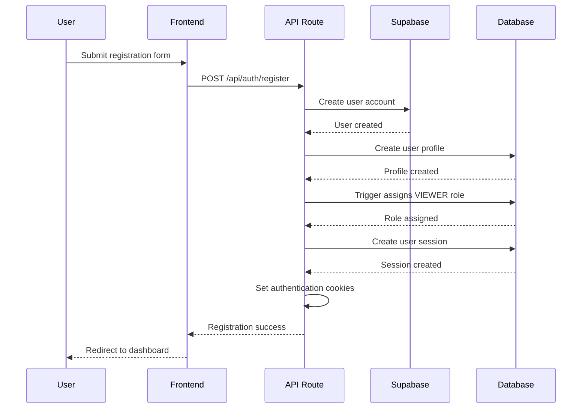
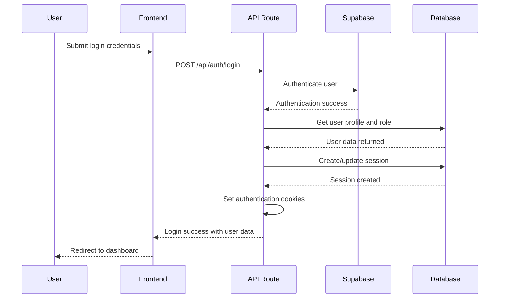
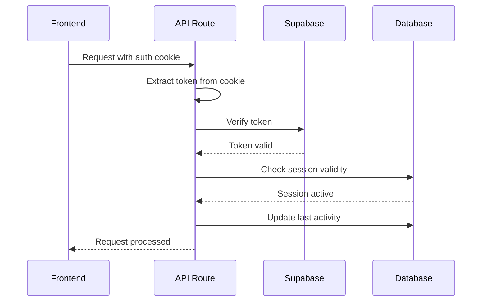
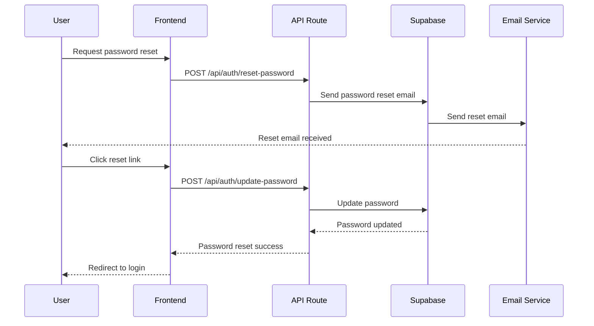
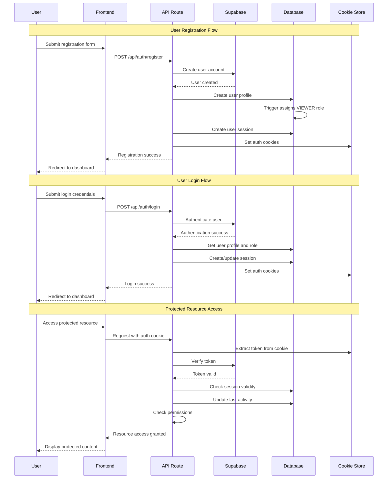
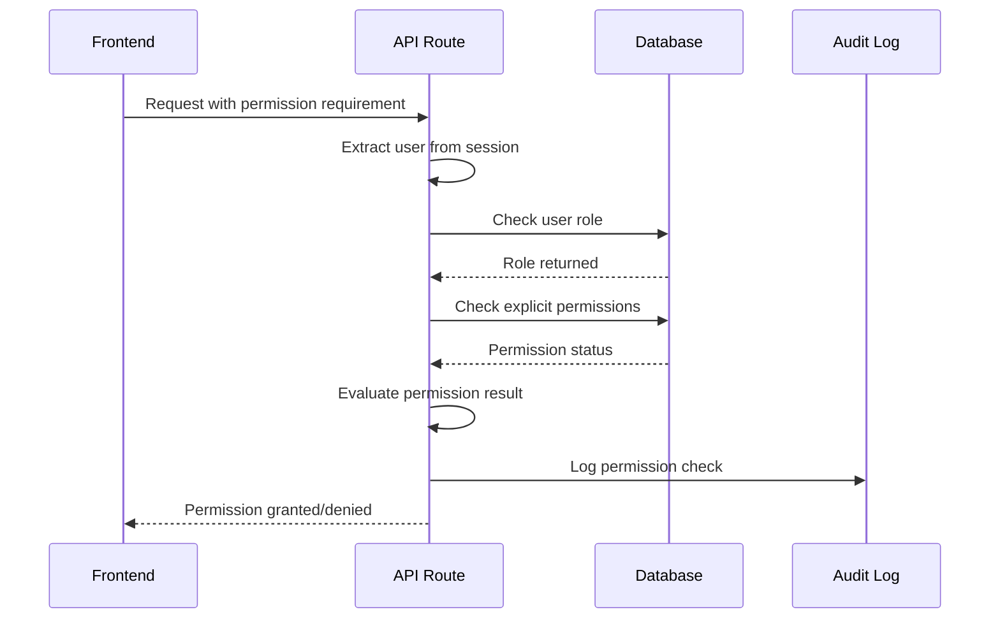
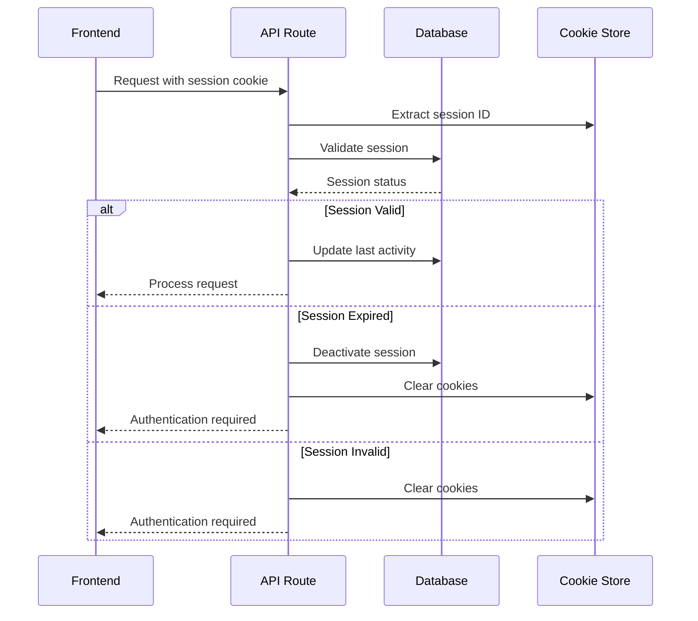

# Social Autopilot Authentication System Architecture

## Table of Contents
1. [System Overview](#system-overview)
2. [Architecture Components](#architecture-components)
3. [Authentication Flows](#authentication-flows)
4. [Database Schema](#database-schema)
5. [Security Requirements](#security-requirements)
6. [Session Management](#session-management)
7. [Role-Based Access Control (RBAC)](#role-based-access-control-rbac)
8. [Permission System](#permission-system)
9. [Audit Logging](#audit-logging)
10. [API Endpoints](#api-endpoints)
11. [Client-Side Integration](#client-side-integration)
12. [Security Considerations](#security-considerations)
13. [Sequence Diagrams](#sequence-diagrams)

## System Overview

The Social Autopilot authentication system is a comprehensive, secure, and scalable solution built on top of Supabase Auth with custom extensions for role-based access control, session management, and audit logging. The system provides:

- **Multi-tenant user management** with role-based permissions
- **Secure session management** with token refresh and expiration
- **Comprehensive audit logging** for security and compliance
- **Granular permission system** with 60+ specific permissions
- **Account settings management** with notification and security preferences
- **Team collaboration features** with user assignment capabilities

### Technology Stack
- **Backend**: Next.js 15.2.0 with App Router
- **Authentication Provider**: Supabase Auth
- **Database**: PostgreSQL (via Supabase)
- **Session Management**: HTTP-only cookies with JWT tokens
- **Frontend**: React with TypeScript
- **UI Components**: Shadcn/ui with Tailwind CSS

## Architecture Components

### Core Components

1. **Authentication Service Layer** (`lib/auth-utils.ts`)
   - User authentication and authorization
   - Session management and token handling
   - Permission checking and role validation
   - Audit logging integration

2. **Type Definitions** (`lib/auth-types.ts`)
   - User roles and permissions enums
   - Authentication interfaces and types
   - Error handling types
   - Request/response payloads

3. **Database Layer** (`setup-auth-tables.sql`)
   - User profiles and roles tables
   - Session tracking and management
   - Audit logs and permission tracking
   - Row-level security policies

4. **API Routes** (`app/api/auth/`)
   - Registration, login, logout endpoints
   - Password reset and account management
   - Session management and token refresh

5. **Client-Side Integration** (`hooks/use-auth.tsx`)
   - Authentication state management
   - Permission-based UI rendering
   - Session persistence and refresh

## Authentication Flows

### 1. User Registration Flow



### 2. User Login Flow



### 3. Session Management Flow



### 4. Password Reset Flow



## Database Schema

### Core Tables

#### 1. User Profiles (`user_profiles`)
```sql
CREATE TABLE user_profiles (
    id UUID DEFAULT gen_random_uuid() PRIMARY KEY,
    user_id TEXT NOT NULL UNIQUE,
    first_name TEXT,
    last_name TEXT,
    display_name TEXT,
    bio TEXT,
    timezone TEXT DEFAULT 'UTC',
    email_notifications BOOLEAN DEFAULT true,
    avatar_url TEXT,
    created_at TIMESTAMPTZ DEFAULT NOW(),
    updated_at TIMESTAMPTZ DEFAULT NOW()
);
```

#### 2. User Roles (`user_roles`)
```sql
CREATE TABLE user_roles (
    id UUID DEFAULT gen_random_uuid() PRIMARY KEY,
    user_id TEXT NOT NULL UNIQUE,
    role TEXT NOT NULL DEFAULT 'VIEWER' 
      CHECK (role IN ('ADMIN', 'EDITOR', 'VIEWER')),
    created_at TIMESTAMPTZ DEFAULT NOW(),
    updated_at TIMESTAMPTZ DEFAULT NOW()
);
```

#### 3. User Permissions (`user_permissions`)
```sql
CREATE TABLE user_permissions (
    id UUID DEFAULT gen_random_uuid() PRIMARY KEY,
    user_id TEXT NOT NULL,
    permission TEXT NOT NULL,
    granted BOOLEAN DEFAULT true,
    granted_at TIMESTAMPTZ DEFAULT NOW(),
    granted_by TEXT,
    created_at TIMESTAMPTZ DEFAULT NOW(),
    updated_at TIMESTAMPTZ DEFAULT NOW(),
    UNIQUE(user_id, permission)
);
```

#### 4. Account Settings (`account_settings`)
```sql
CREATE TABLE account_settings (
    id UUID DEFAULT gen_random_uuid() PRIMARY KEY,
    user_id TEXT NOT NULL UNIQUE,
    notification_preferences JSONB DEFAULT '{
        "email_notifications": true,
        "push_notifications": true,
        "mention_notifications": true,
        "post_approval_notifications": true,
        "analytics_notifications": true,
        "security_notifications": true,
        "marketing_emails": false,
        "weekly_digest": false,
        "daily_summary": false
    }',
    security_settings JSONB DEFAULT '{
        "two_factor_enabled": false,
        "login_notifications": true,
        "session_timeout_minutes": 60,
        "require_password_for_sensitive_actions": true,
        "failed_login_attempts": 0
    }',
    account_preferences JSONB DEFAULT '{
        "language": "en",
        "timezone": "UTC",
        "date_format": "MM/DD/YYYY",
        "time_format": "12h",
        "theme": "system",
        "compact_mode": false,
        "auto_save_drafts": true,
        "default_post_visibility": "public"
    }',
    created_at TIMESTAMPTZ DEFAULT NOW(),
    updated_at TIMESTAMPTZ DEFAULT NOW()
);
```

#### 5. User Sessions (`user_sessions`)
```sql
CREATE TABLE user_sessions (
    id UUID DEFAULT gen_random_uuid() PRIMARY KEY,
    user_id TEXT NOT NULL,
    session_id TEXT NOT NULL UNIQUE,
    ip_address INET,
    user_agent TEXT,
    created_at TIMESTAMPTZ DEFAULT NOW(),
    last_activity TIMESTAMPTZ DEFAULT NOW(),
    expires_at TIMESTAMPTZ,
    is_active BOOLEAN DEFAULT true
);
```

#### 6. Audit Logs (`audit_logs`)
```sql
CREATE TABLE audit_logs (
    id UUID DEFAULT gen_random_uuid() PRIMARY KEY,
    user_id TEXT,
    action TEXT NOT NULL,
    resource_type TEXT,
    resource_id TEXT,
    details JSONB,
    ip_address INET,
    user_agent TEXT,
    created_at TIMESTAMPTZ DEFAULT NOW()
);
```

#### 7. Permission Audit Logs (`permission_audit_logs`)
```sql
CREATE TABLE permission_audit_logs (
    id UUID DEFAULT gen_random_uuid() PRIMARY KEY,
    user_id TEXT,
    permission TEXT NOT NULL,
    action TEXT NOT NULL CHECK (action IN ('granted', 'denied', 'checked')),
    resource_type TEXT,
    resource_id TEXT,
    result BOOLEAN,
    details JSONB,
    ip_address INET,
    user_agent TEXT,
    created_at TIMESTAMPTZ DEFAULT NOW()
);
```

### Database Functions

#### 1. Role Assignment Trigger
```sql
CREATE OR REPLACE FUNCTION assign_default_role()
RETURNS TRIGGER AS $$
BEGIN
    INSERT INTO user_roles (user_id, role)
    VALUES (NEW.user_id, 'VIEWER')
    ON CONFLICT (user_id) DO NOTHING;
    RETURN NEW;
END;
$$ LANGUAGE plpgsql;
```

#### 2. Permission Check Function
```sql
CREATE OR REPLACE FUNCTION has_permission(user_id_param TEXT, permission_param TEXT)
RETURNS BOOLEAN AS $$
DECLARE
    user_role TEXT;
    has_perm BOOLEAN;
BEGIN
    SELECT get_user_role(user_id_param) INTO user_role;
    
    -- Check explicit permissions first
    SELECT granted INTO has_perm
    FROM user_permissions
    WHERE user_id = user_id_param AND permission = permission_param;
    
    -- If explicit permission found, return it
    IF FOUND THEN
        RETURN has_perm;
    END IF;
    
    -- Otherwise, check role-based permissions
    CASE user_role
        WHEN 'ADMIN' THEN
            RETURN true; -- Admins have all permissions
        WHEN 'EDITOR' THEN
            RETURN permission_param NOT IN ('MANAGE_USERS', 'VIEW_ANALYTICS', 'MANAGE_AUTOMATION');
        WHEN 'VIEWER' THEN
            RETURN permission_param IN (
                'VIEW_POSTS', 'VIEW_DASHBOARD', 'VIEW_PROFILE', 
                'VIEW_ACCOUNT_SETTINGS', 'VIEW_NOTIFICATIONS'
            );
        ELSE
            RETURN false;
    END CASE;
END;
$$ LANGUAGE plpgsql SECURITY DEFINER;
```

## Security Requirements

### Password Policies
- **Minimum Length**: 6 characters (configurable via Supabase)
- **Complexity**: Configurable requirements (letters, digits, symbols)
- **Storage**: Hashed using Supabase's secure hashing
- **Reset**: Secure email-based reset flow

### Token Management
- **Access Tokens**: JWT tokens with 1-hour expiration
- **Refresh Tokens**: 7-day expiration with rotation
- **Storage**: HTTP-only cookies for security
- **Validation**: Server-side token verification on each request

### Session Security
- **Session IDs**: Unique, non-guessable identifiers
- **Expiration**: 30-day maximum session lifetime
- **Activity Tracking**: Last activity timestamp updates
- **IP Tracking**: IP address and user agent logging
- **Concurrent Sessions**: Multiple sessions allowed per user

### Row-Level Security (RLS)
All database tables implement RLS policies to ensure:
- Users can only access their own data
- Admins can access all data
- Proper permission checks for sensitive operations

## Session Management

### Session Lifecycle
1. **Creation**: New session created on login
2. **Validation**: Session validated on each request
3. **Activity Updates**: Last activity timestamp updated
4. **Expiration**: Sessions expire after 30 days of inactivity
5. **Cleanup**: Expired sessions automatically removed

### Session Configuration
```typescript
const SESSION_CONFIG = {
  accessTokenExpiry: 60 * 60, // 1 hour
  refreshTokenExpiry: 7 * 24 * 60 * 60, // 7 days
  sessionIdExpiry: 30 * 24 * 60 * 60, // 30 days
  cookieOptions: {
    httpOnly: true,
    secure: process.env.NODE_ENV === 'production',
    sameSite: 'lax' as const,
    path: '/'
  }
}
```

### Cookie Management
- **Access Token**: `sb-auth-token` (1 hour)
- **Refresh Token**: `sb-refresh-token` (7 days)
- **Session ID**: `sb-session-id` (30 days)

## Role-Based Access Control (RBAC)

### User Roles

#### 1. ADMIN
- **Full System Access**: All permissions granted
- **User Management**: Create, edit, delete users
- **System Configuration**: Manage settings and integrations
- **Audit Access**: View all audit logs and system logs

#### 2. EDITOR
- **Content Management**: Create, edit, schedule posts
- **Media Management**: Upload and manage media files
- **Analytics Access**: View analytics and export data
- **Team Collaboration**: Assign users to teams
- **Limited User Management**: View users only

#### 3. VIEWER
- **Read-Only Access**: View posts, analytics, and user information
- **Limited Permissions**: No creation or modification rights
- **Team Visibility**: View team assignments only

### Permission Matrix

| Permission | ADMIN | EDITOR | VIEWER |
|------------|-------|--------|--------|
| CREATE_POST | ✅ | ✅ | ❌ |
| EDIT_POST | ✅ | ✅ | ❌ |
| DELETE_POST | ✅ | ❌ | ❌ |
| PUBLISH_POST | ✅ | ❌ | ❌ |
| APPROVE_POST | ✅ | ❌ | ❌ |
| SCHEDULE_POST | ✅ | ✅ | ❌ |
| VIEW_POST | ✅ | ✅ | ✅ |
| UPLOAD_MEDIA | ✅ | ✅ | ❌ |
| DELETE_MEDIA | ✅ | ❌ | ❌ |
| MANAGE_CONTENT | ✅ | ✅ | ❌ |
| VIEW_ANALYTICS | ✅ | ✅ | ✅ |
| EXPORT_DATA | ✅ | ✅ | ❌ |
| VIEW_ENGAGEMENT_METRICS | ✅ | ✅ | ✅ |
| VIEW_PERFORMANCE_REPORTS | ✅ | ✅ | ✅ |
| MANAGE_USERS | ✅ | ❌ | ❌ |
| ASSIGN_ROLES | ✅ | ❌ | ❌ |
| VIEW_USERS | ✅ | ✅ | ✅ |
| DEACTIVATE_USERS | ✅ | ❌ | ❌ |
| MANAGE_SETTINGS | ✅ | ❌ | ❌ |
| MANAGE_INTEGRATIONS | ✅ | ❌ | ❌ |
| VIEW_SYSTEM_LOGS | ✅ | ❌ | ❌ |
| MANAGE_TEAMS | ✅ | ❌ | ❌ |
| ASSIGN_TO_TEAMS | ✅ | ✅ | ✅ |
| INVITE_MEMBERS | ✅ | ❌ | ❌ |
| REMOVE_MEMBERS | ✅ | ❌ | ❌ |
| MANAGE_AUTOMATION | ✅ | ❌ | ❌ |
| CREATE_AUTO_REPLIES | ✅ | ✅ | ❌ |
| MANAGE_SCHEDULING | ✅ | ❌ | ❌ |
| VIEW_BILLING | ✅ | ❌ | ❌ |
| MANAGE_SUBSCRIPTION | ✅ | ❌ | ❌ |
| ACCESS_API | ✅ | ✅ | ❌ |
| MANAGE_API_KEYS | ✅ | ❌ | ❌ |

## Permission System

### Permission Categories

#### 1. Post Management (7 permissions)
- CREATE_POST, EDIT_POST, DELETE_POST, PUBLISH_POST, APPROVE_POST, SCHEDULE_POST, VIEW_POST

#### 2. Content Management (3 permissions)
- UPLOAD_MEDIA, DELETE_MEDIA, MANAGE_CONTENT

#### 3. Analytics and Reporting (4 permissions)
- VIEW_ANALYTICS, EXPORT_DATA, VIEW_ENGAGEMENT_METRICS, VIEW_PERFORMANCE_REPORTS

#### 4. User Management (4 permissions)
- MANAGE_USERS, ASSIGN_ROLES, VIEW_USERS, DEACTIVATE_USERS

#### 5. Settings and Configuration (3 permissions)
- MANAGE_SETTINGS, MANAGE_INTEGRATIONS, VIEW_SYSTEM_LOGS

#### 6. Team Management (4 permissions)
- MANAGE_TEAMS, ASSIGN_TO_TEAMS, INVITE_MEMBERS, REMOVE_MEMBERS

#### 7. Automation (3 permissions)
- MANAGE_AUTOMATION, CREATE_AUTO_REPLIES, MANAGE_SCHEDULING

#### 8. Billing and Subscription (2 permissions)
- VIEW_BILLING, MANAGE_SUBSCRIPTION

#### 9. API Access (2 permissions)
- ACCESS_API, MANAGE_API_KEYS

### Permission Checking
```typescript
// Check if user has specific permission
export async function hasPermission(
  userId: string, 
  permission: Permission
): Promise<boolean>

// Check resource-based permission
export async function hasResourcePermission(
  userId: string,
  permission: Permission,
  resourceType: string,
  resourceId: string
): Promise<boolean>
```

## Audit Logging

### Audit Log Types

#### 1. Authentication Events
- `login_success`, `login_failed`, `logout`, `password_change`, `password_reset`

#### 2. User Management Events
- `user_created`, `user_updated`, `user_deleted`, `role_changed`, `permission_granted`, `permission_revoked`

#### 3. Content Events
- `post_created`, `post_updated`, `post_deleted`, `post_published`, `post_scheduled`

#### 4. System Events
- `settings_updated`, `integration_configured`, `api_key_created`, `api_key_revoked`

### Audit Log Structure
```typescript
interface AuditLogEntry {
  id: string
  user_id: string
  action: string
  resource_type: string
  resource_id?: string
  details?: Record<string, any>
  ip_address?: string
  user_agent?: string
  created_at: string
}
```

### Permission Audit Logs
```typescript
interface PermissionAuditEntry {
  id: string
  user_id: string
  action: 'permission_check' | 'permission_granted' | 'permission_denied' | 'role_changed'
  permission?: Permission
  resource_type?: string
  resource_id?: string
  result: 'allowed' | 'denied'
  reason?: string
  ip_address?: string
  user_agent?: string
  created_at: string
}
```

## API Endpoints

### Authentication Endpoints

#### POST /api/auth/register
- **Purpose**: Register new user account
- **Request**: `RegisterRequest`
- **Response**: User data with session cookies
- **Security**: Rate limiting, input validation

#### POST /api/auth/login
- **Purpose**: Authenticate user and create session
- **Request**: `LoginRequest`
- **Response**: User data with session cookies
- **Security**: Rate limiting, failed attempt tracking

#### POST /api/auth/logout
- **Purpose**: Terminate user session
- **Request**: None (uses session cookies)
- **Response**: Success confirmation
- **Security**: Session invalidation

#### POST /api/auth/refresh
- **Purpose**: Refresh access token
- **Request**: None (uses refresh token cookie)
- **Response**: New access token
- **Security**: Token rotation

#### POST /api/auth/reset-password
- **Purpose**: Initiate password reset
- **Request**: `PasswordResetRequest`
- **Response**: Success confirmation
- **Security**: Email verification

#### POST /api/auth/update-password
- **Purpose**: Update user password
- **Request**: `PasswordUpdateRequest`
- **Response**: Success confirmation
- **Security**: Current password verification

### Account Management Endpoints

#### GET /api/account-settings
- **Purpose**: Get user account settings
- **Request**: None (uses session)
- **Response**: `AccountSettings`
- **Security**: User can only access own settings

#### PUT /api/account-settings
- **Purpose**: Update account settings
- **Request**: `AccountSettings`
- **Response**: Updated settings
- **Security**: User can only update own settings

#### GET /api/account-settings/sessions
- **Purpose**: Get user active sessions
- **Request**: None (uses session)
- **Response**: `SessionInfo[]`
- **Security**: User can only view own sessions

#### DELETE /api/account-settings/sessions/:sessionId
- **Purpose**: Terminate specific session
- **Request**: None (uses session)
- **Response**: Success confirmation
- **Security**: User can only terminate own sessions

## Client-Side Integration

### Authentication Hook
```typescript
// hooks/use-auth.tsx
export function useAuth() {
  const [user, setUser] = useState<AuthUser | null>(null)
  const [loading, setLoading] = useState(true)
  
  // Authentication methods
  const login = async (credentials: LoginRequest) => Promise<void>
  const register = async (data: RegisterRequest) => Promise<void>
  const logout = async () => Promise<void>
  const refreshSession = async () => Promise<void>
  
  return { user, loading, login, register, logout, refreshSession }
}
```

### Permission Components
```typescript
// components/auth/permission-gate.tsx
export function CanViewAnalytics({ children }: { children: React.ReactNode }) {
  const { user } = useAuth()
  const hasPermission = user?.permissions.includes(Permission.VIEW_ANALYTICS)
  
  return hasPermission ? <>{children}</> : null
}
```

### Protected Routes
```typescript
// components/auth/protected-route.tsx
export function ProtectedRoute({ 
  children, 
  requiredPermission 
}: { 
  children: React.ReactNode
  requiredPermission?: Permission 
}) {
  const { user, loading } = useAuth()
  
  if (loading) return <LoadingSpinner />
  if (!user) return <LoginRedirect />
  if (requiredPermission && !user.permissions.includes(requiredPermission)) {
    return <AccessDenied />
  }
  
  return <>{children}</>
}
```

## Security Considerations

### 1. Authentication Security
- **Password Hashing**: Supabase handles secure password hashing
- **Token Security**: JWT tokens with proper expiration and rotation
- **Session Management**: Secure session tracking with activity monitoring
- **Rate Limiting**: API endpoints protected against brute force attacks

### 2. Authorization Security
- **Role-Based Access**: Granular permission system with role hierarchy
- **Resource-Based Permissions**: Fine-grained access control for specific resources
- **Audit Logging**: Comprehensive logging of all permission checks and changes
- **Row-Level Security**: Database-level access control policies

### 3. Data Protection
- **Encryption**: Sensitive data encrypted at rest and in transit
- **Privacy**: User data access restricted to authorized users only
- **Compliance**: Audit logs support compliance requirements
- **Data Retention**: Configurable data retention policies

### 4. Infrastructure Security
- **HTTPS**: All communications encrypted in transit
- **CORS**: Proper cross-origin resource sharing configuration
- **Environment Variables**: Sensitive configuration stored securely
- **Database Security**: Row-level security and proper access controls

## Sequence Diagrams

### Complete Authentication Flow


### Permission Check Flow


### Session Management Flow


---

## Conclusion

The Social Autopilot authentication system provides a comprehensive, secure, and scalable solution for user authentication and authorization. The system is designed with security best practices, comprehensive audit logging, and granular permission management to support complex business requirements while maintaining ease of use and maintainability.

The architecture supports:
- **Scalability**: Built on Supabase for automatic scaling
- **Security**: Multiple layers of security controls
- **Compliance**: Comprehensive audit logging
- **Flexibility**: Granular permission system
- **Maintainability**: Clean separation of concerns
- **User Experience**: Seamless authentication flows

This architecture document serves as the foundation for implementing, maintaining, and extending the authentication system as the application grows and evolves.
